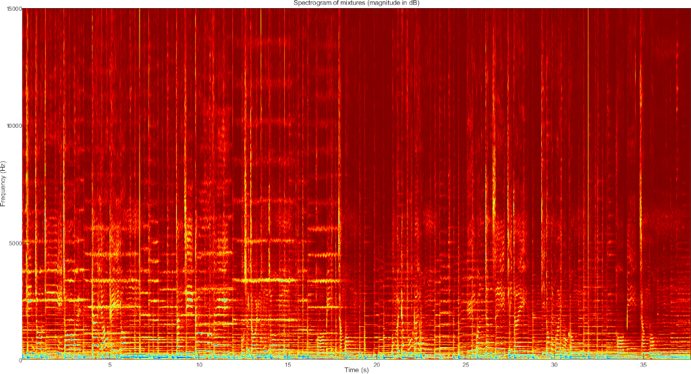
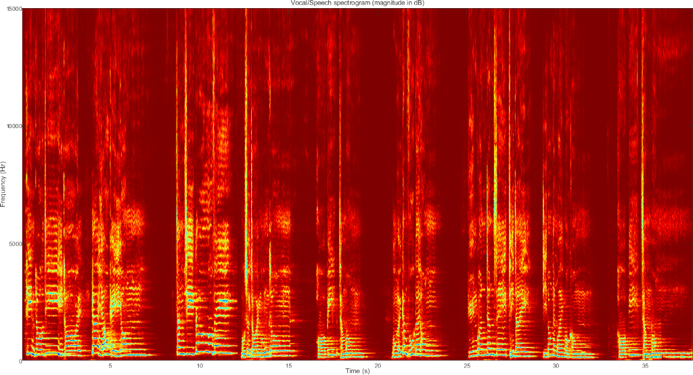
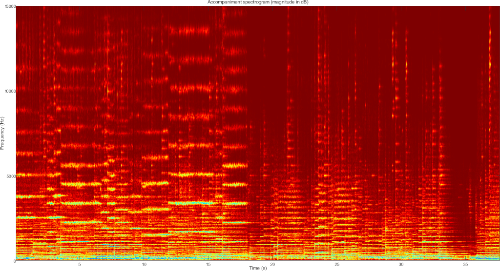
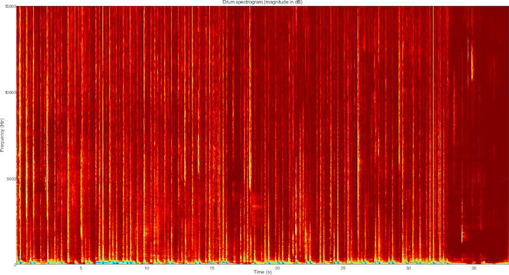
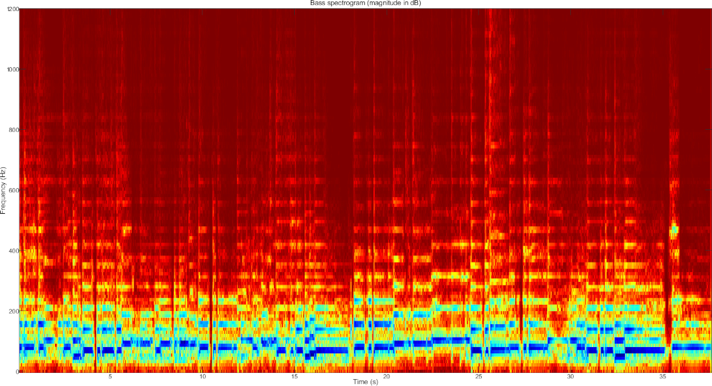
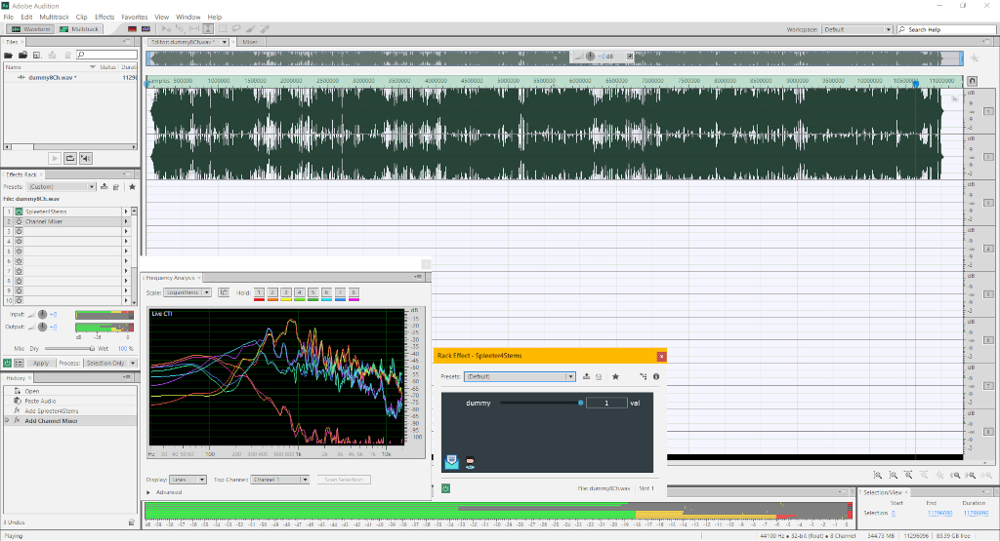

# Real time monaural source separation base on fully convolutional neural network operates on Time-frequency domain
AI Source separator written in C running a U-Net model trained by Deezer, separate your audio input to Drum, Bass, Accompaniment and Vocal/Speech with Spleeter model.

#### Network overview
The network accepts 2 channels magnitude spectrogram as input, U-Net is constructed using 6 pairs of encoder/decoder, final dilated convolution layer expand second last feature map into 2 channels for stereo inference.

For 4 stem track separation, we need 4 networks to achieve separation, the neural network computes probability mask function as final output.

The encoder uses convolutional layer with stride = 2, reduce the need for max pooling, a great improvement for a real-time system.

Batch normalization and activation is followed by the output of each convolution layer except the bottleneck of U-Net.

The decoder uses transposed convolution with stride = 2 for upsampling, with their input concatenated with each encoder Conv2D pair, worth notice, batch normalization and activation isn't the output of each encoder layers we are going to concatenate. The decoder side concatenates just the convolution output of the layers of an encoder. 

#### Real time system design
Deep learning in inference time is all about GEMM, we have to implement im2col() function with stride, padding, dilation that can handle TensorFlow-styled CNN or even Pytorch-styled convolutional layer. We also need col2im() function with stride and padding for transposed convolutional layers.

After the construction of the model in C, the test run show promising performance, we process 14 seconds song within 600 ms wall clock, numeric accuracy is about 1e-4 MSE of TensorFlow model, indicate the architecture is correct.

I don't plan to use libtensorflow, I'll explain why.

Deep learning functions in existing code: im2col(), col2im(), gemm(), conv_out_dim(), transpconv_out_dim()

We have to initialize a buck of memory and spawn some threads before processing begins, we allow developers to adjust the number of frequency bins and time frames for the neural network to inference, the __official__ Spleeter set FFTLength = 4096, Flim = 1024 and T = 512 for default CNN input, then the neural network will predict mask up to 11kHz and take about 11 secs.

Which mean real-world latency of default setting using __official__ model will cost you 11 secs + overlap-add sample latency, no matter how fast your CPU gets, the sample latency is intrinsical.

I decide to reduce the time-frequency frames collection to 1 / 4, that means we modify T to 128 at the cost of a slightly inaccurate result.

However, all this reduce sample latency but doesn't solve the fact that our system is lagging, because each deep learning function call cost 600 ms, it is like we stopping the audio pipeline for 600 ms for the CNN.

Ok, then we have to go for the double-buffered design.

The 2D image buffering mechanism is **double-buffered**, that means we collect 128 frames, output last 128-256 frame, compute 1-128 frame in the background threads, we use samples latency to trade computation workload, result in 6 seconds latency, still lower than __official__ default setting.

The program spawns 5 threads, we got 1 thread for FFT, T-F masking, IFFT, overlapping, while 4 other threads are actively doing deep learning task in the background.

We got 4 sources to demix, we run 4 CNN in parallel, each gemm() is sequential.

#### Demo and screenshot

#### System Requirements and Installation
Currently, the UI is implemented in JUCE.

Any compilable audio plugin host or the standalone program will run the program.

Win32 API are used to find user profile directory to fread the deep learning model.

Other than that, the source separator should able to run Linux and macOS too.

I haven't investigated the GEMM function for ARM device, if anyone finds good implementation, perhaps make a pull request to gemm.c.

Memory consumption is a big deal for mobile phone, 4 stems model uses 700Mb RAM, 2 stems model uses around 300Mb RAM, currently have no plan for supporting 4 stems for mobile phone.

#### FAQ
1. Why not just go for libtensorflow for everything, TensorFlow is static computation graph-based, should be suitable for audio inference?
A: There is a couple of reason for that. First, Python program that related to the Time-frequency transform and CNN entry point must be rewritten before generate a useful Tensorflow freezed model(.pb), no matter how static the computation graph is, why?

Simply because __Spleeter__ official Tensorflow model pack 4 stems/CNN into same checkpoint file, 4 stems are totally sequential/run in series, the reason Tensorflow model run so fast, is SIMD instruction, other than that Tensorflow doesn't parallel the code path you want.
You need to write a Python program, you will going to split the checkpoint of 4 stems model into 4 freezed graph and then use libtensorflow API to call 4 graphs on each thread.

2. The audio processor is so slow, slower than Python version on the same hardware.
A: Not really, the plugin isn't like __official__ Spleeter, we can't do everything in offline, there's a big no to write a real-time signal processor in offline.
The audio processor buffering system will cost extra time to process compared to offline Python program.
At the same time, the FFT implementation isn't the best of course, but definitely comparable to Tensorflow.
Different audio plugin host or streaming system have different buffer size, the system with a small buffer will definitely make the system slower.

#### License
Other than the project main components are GPL-licensed, I don't know much about Intel MKL.

#### Credit
Deezer, of source, this processor won't happen without their great model.

Intel MKL, without MKL, the convolution operation run 40x slower.